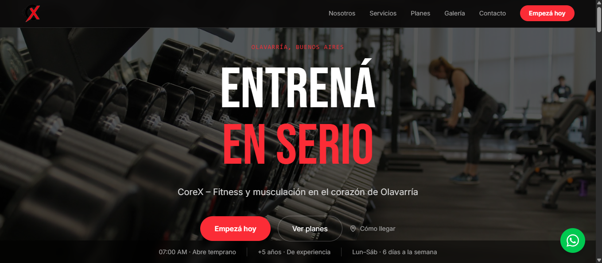

# CoreX Gimnasio — Landing Page


Landing page profesional para **Gimnasio CoreX**, un negocio real de fitness y musculación ubicado en Olavarría, Buenos Aires.
Diseñada para convertir visitantes en clientes, con contacto directo vía WhatsApp y una experiencia mobile-first.

## 🔗 Links

- **Demo en vivo:** [gimnasio-corex.web.app](https://gimnasio-corex.web.app)
- **Repositorio:** [github.com/lautaro-ruspil/gimnasio-corex](https://github.com/lautaro-ruspil/gimnasio-corex)

## ✨ Características

- 🏋️ Hero con imagen de fondo, tipografía impactante y CTAs
- 💪 Sección de servicios con cards animadas
- 📋 Planes de membresía con CTA directo a WhatsApp
- 🖼️ Galería de imágenes con hover effects
- 💬 Testimonios de clientes
- 📝 Formulario de contacto con validación (React Hook Form)
- 📱 Botón flotante de WhatsApp
- 📐 100% responsive — mobile first
- ✨ Animaciones de entrada con Framer Motion

## 🛠 Stack tecnológico

| Tecnología       | Uso                      |
| ---------------- | ------------------------ |
| React 18         | UI y componentes         |
| Vite             | Bundler y dev server     |
| Tailwind CSS v4  | Estilos utility-first    |
| Framer Motion    | Animaciones de entrada   |
| React Hook Form  | Validación de formulario |
| lucide-react     | Íconos                   |
| Firebase Hosting | Deploy                   |

## 📸 Preview



## 🚀 Instalación y uso

```bash
git clone https://github.com/lautaro-ruspil/gimnasio-corex.git
cd gimnasio-corex
npm install
npm run dev
```

El servidor de desarrollo se levanta en `http://localhost:5173`.

## 📁 Estructura del proyecto

```
src/
├── components/          # Componentes de cada sección de la landing
│   ├── Navbar.jsx
│   ├── Hero.jsx
│   ├── Benefits.jsx
│   ├── Services.jsx
│   ├── Plans.jsx
│   ├── About.jsx
│   ├── Gallery.jsx
│   ├── Testimonials.jsx
│   ├── Contact.jsx
│   ├── Footer.jsx
│   └── WhatsAppButton.jsx
├── data/                # Datos estáticos (planes, servicios, testimonios)
│   ├── plans.js
│   ├── services.js
│   └── testimonials.js
└── App.jsx              # Componente raíz que ensambla las secciones
```

## 🎯 Contexto

Proyecto desarrollado como parte del portfolio de **Lautaro Ruspil**, basado en datos reales del Gimnasio CoreX de Olavarría, Buenos Aires. Las imágenes provienen de Unsplash y la información del negocio fue extraída de su cuenta de Instagram. Disponible para ser adaptado y vendido al negocio real.

## 📄 Licencia

MIT

---

Desarrollado por [Lautaro Ruspil](https://lautaro-ruspil.web.app) · Olavarría, Argentina
